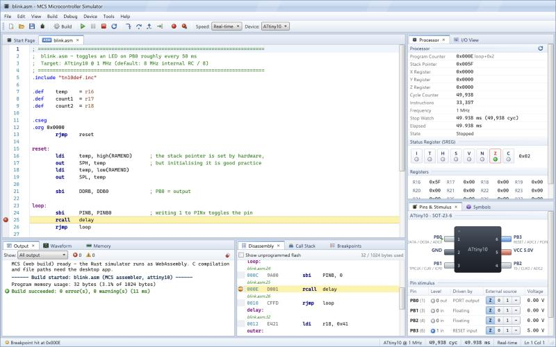

# MCS — Microcontroller Simulator

A cycle-accurate microcontroller simulator and source-level debugger with a Windows 7–style interface. It runs on Windows, macOS and Linux. The first supported family is the **ATtiny4/5/9/10**: the AVRrc reduced core in a SOT-23-6 package.



## Download

Get the latest installers from the **[Releases page](https://github.com/GabePurc/MCS/releases/latest)**:

- **Windows 10/11:** `MCS.Microcontroller.Simulator_<version>_x64-setup.exe`. Run it; no administrator rights are needed. The installer isn't signed yet, so if SmartScreen says *"Windows protected your PC"*, click **More info → Run anyway**.
- **macOS 10.15+ (Apple Silicon and Intel):** `MCS.Microcontroller.Simulator_<version>_universal.dmg`. Drag the app to Applications. The first time, right-click it and choose **Open** (it isn't notarized yet).

Assembly programs work out of the box. To build C programs, also install avr-gcc (see [C support](#c-support)).

## Features

- **Simulation engine in Rust** (`crates/mcs-sim`)
  - Pre-decoded flash and a jump-table executor give about 140 MIPS on an Apple M-series chip. That is roughly 180× real time for an ATtiny10 at 1 MHz.
  - Peripherals are event-driven, so they cost nothing while idle. In sleep, the simulator skips straight to the next event.
  - Peripheral models:
    - GPIO with pull-ups, the PINx toggle and the RESET pin
    - INT0 and pin-change interrupts
    - Timer0: all 16 waveform-generation modes, PWM output, input capture, external clock and the TEMP register
    - Analog comparator
    - 8-bit ADC with auto-trigger
    - Watchdog: interrupt and reset modes, WDRF/WDE lock, CCP-protected changes
    - Clock source and prescaler (CCP protected)
    - Sleep modes with the datasheet's wake-up sources
    - Power reduction, VCC level monitor, reset flags, NVM, fuse and signature mapping
  - Timing follows the ATtiny4/5/9/10 datasheet: instruction cycle counts, 4-cycle interrupt response, and the extra instruction after `SEI` and `RETI`.
- **Assembler** (`crates/mcs-asm`): compatible with Atmel avrasm2.
  - Supports macros, conditionals, includes, expressions, and device definitions (`.include "tn10def.inc"`) generated from the device model.
  - Errors carry exact line and column, and the assembler rejects instructions and registers the device doesn't have.
- **C and GNU assembler** through your installed **avr-gcc**, which is detected automatically. Programs are debugged at the source line using DWARF line tables.
- **Imports** Intel HEX and ELF images built elsewhere, and exports Intel HEX.
- **Debugger**
  - Breakpoints in the editor margin or the disassembly
  - Step into, over and out by source line or by instruction
  - Run to cursor, set next statement, call stack and stop watch
- **Inspect everything**
  - Processor: PC, SP, X/Y/Z, SREG flags and registers, all editable
  - I/O view: peripheral, register and bit tree with live, editable values
  - Hex memory editor for data space and flash
  - Disassembly, plus a symbols and watch list
  - Pin stimulus: logic levels, analog voltages and VCC
  - Logic-analyzer waveform window with measurement cursors
  - Changed values are highlighted in red, as in Visual Studio and Atmel Studio.
- **Windows 7 look on every OS**
  - Aero caption, glossy controls, Explorer-style selection, dockable tool windows with drag-and-drop tabs
  - Bundled Selawik font (a metric-compatible Segoe UI clone) and Cascadia Mono
- **Web build**: the same Rust core compiles to WebAssembly (`crates/mcs-wasm`), so the UI also runs in a browser.

## Getting started

Prerequisites:

- Node ≥ 20.19 (24 recommended, see `.nvmrc`)
- A stable Rust toolchain
- The Tauri system dependencies for your OS: [tauri.app/start/prerequisites](https://tauri.app/start/prerequisites/). On Linux that means WebKitGTK 4.1.

```bash
npm install
npm run dev
```

`npm run dev` starts the desktop app in development mode.

Other commands:

| Command | What it does |
|---|---|
| `npm run build` | Builds release installers (`.msi`/`.exe`, `.dmg`/`.app`, `.deb`/`.AppImage`/`.rpm`) |
| `npm run web` | Builds the WebAssembly core and serves the UI in a browser (needs `rustup target add wasm32-unknown-unknown`) |
| `npm test` | Runs all Rust tests plus the front-end unit tests |
| `npm run typecheck` | Type-checks the UI |

Pushing a `v*` tag runs `.github/workflows/release.yml`, which builds installers for all three platforms.

### C support

Assembly needs nothing extra. For C and `.S` files, install avr-gcc with avr-libc:

- **macOS:** `brew tap osx-cross/avr && brew install avr-gcc@14`, or the Arduino IDE.
- **Windows:** Microchip's AVR 8-bit toolchain, or the Arduino IDE.
- **Linux:** `sudo apt install gcc-avr avr-libc` (or your distribution's equivalent).

MCS searches `PATH` and the usual install locations. You can also set the path under **Tools ▸ Toolchain Options**.

## Using it

1. Open an example from the Start Page, for example *Blink (assembly)*.
2. **F7** builds. **F5** runs or continues. **F10**, **F11** and **Shift+F11** step over, into and out. **F9** toggles a breakpoint.
3. Drive inputs in **Pins & Stimulus**: click a pin to cycle Z → 1 → 0, or choose `~` for an analog voltage. Watch outputs in **Waveform**: scroll to zoom, drag to pan, click and Shift+click to measure.
4. Double-click any value to edit it. Click SREG flags or I/O bit boxes to toggle them.
5. Choose the speed in the toolbar: 1/100× slow motion, real time, 10×, or maximum.

## Project layout

```
crates/mcs-core     ISA table (decoder/disassembler/assembler share it), device specs, program types
crates/mcs-sim      CPU executor, machine, peripherals, scheduler, debugger session
crates/mcs-asm      avrasm2-compatible assembler
crates/mcs-formats  Intel HEX, ELF and DWARF line-table loaders
crates/mcs-api      Front-end services shared by the desktop and web hosts
crates/mcs-wasm     WebAssembly adapter (JSON ABI)
src-tauri           Desktop app: Tauri commands, simulation thread, avr-gcc integration
src/ui              React UI (Win7 theme, docking, CodeMirror editor, panels)
examples            Example programs (also bundled into the app)
```

See [docs/ARCHITECTURE.md](docs/ARCHITECTURE.md) for how the pieces fit together and how to add another microcontroller. See [docs/ROADMAP.md](docs/ROADMAP.md) for status and next steps.

## License

MIT. The bundled fonts are under the SIL Open Font License 1.1.
